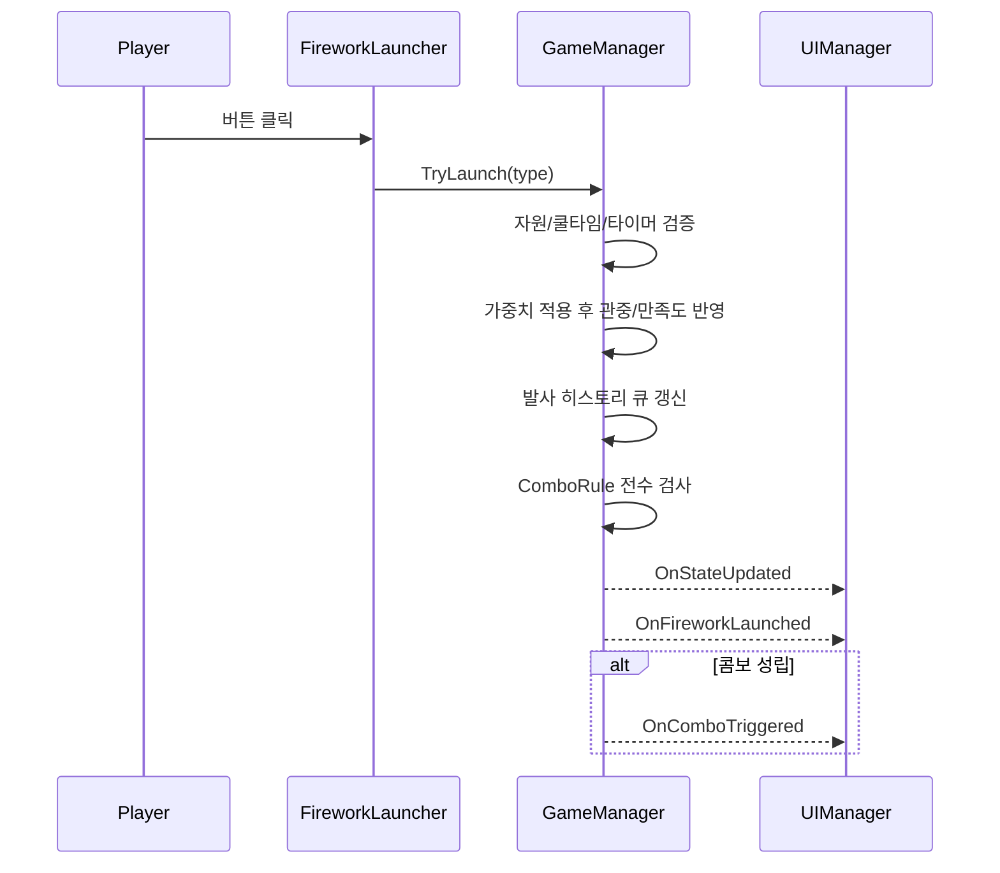

# 서울세계불꽃축제 시뮬레이터 아키텍처

## 1. 클래스 계층 구조
- `FireworkType` (Enum): `Peony`, `Niagara`, `Ring`, `Willow`, `Crossette`
- `FireworkData` (ScriptableObject): 불꽃 속성 직렬화
- `ComboRule` (ScriptableObject): 콤보 조건 및 보상 직렬화
- `GameManager` (MonoBehaviour, Singleton): 180초 타이머 루프, 자원 생성, 콤보 큐 판정, 타임라인 가중치 연산, 게임 이벤트 발행
- `FireworkLauncher` (MonoBehaviour): 버튼 입력 처리, 쿨다운 Radial Fill 제어, 파티클 인스턴스화, 사운드 트리거
- `UIManager` (MonoBehaviour): 상단 UI 갱신, 콤보 토스트 팝업 제어, 결과 리포트 패널 활성화
- `ShareManager` (MonoBehaviour): UI 제외 순수 결과 카드 고해상도 스크린샷 캡처 및 로컬/네이티브 저장

## 2. 런타임 데이터 구조

### FireworkData
- 식별자: `FireworkType type`
- 표시 정보: `string displayName`, `Sprite icon`
- 수치 정보: `float cooldown`, `int resourceCost`, `int audienceGain`, `int satisfactionGain`
- 이펙트: `GameObject particlePrefab`, `AudioClip launchSfx`

### ComboRule
- 식별자: `string comboName`
- 요구 패턴: `FireworkType[] requiredSequence`
- 판정 설정: `bool enforceOrder`, `float timeLimitSeconds`
- 보상: `int bonusAudience`, `int bonusSatisfaction`
- UX: `string toastMessage`

## 3. 시스템 책임 분리
- `GameManager`: 게임 상태의 단일 진실 공급자(시간/자원/점수/발사 히스토리)
- `FireworkLauncher`: 타입별 입력 게이트(자원/쿨다운 검사) 및 VFX/SFX 트리거
- `UIManager`: 모델-뷰 연결 계층(이벤트 구독 기반 렌더링)
- `ShareManager`: 캡처 파이프라인 전담(렌더 완료 이후 PNG 저장)

## 4. 이벤트 구독 흐름도 (Mermaid)

```mermaid
flowchart TD
    Player[Player Input] --> Launcher[FireworkLauncher]
    Launcher -->|RequestLaunch(type)| GM[GameManager]

    GM -->|OnStateUpdated| UI[UIManager]
    GM -->|OnFireworkLaunched| UI
    GM -->|OnComboTriggered| UI
    GM -->|OnGameEnded| UI
    GM -->|OnGameEnded| Share[ShareManager]

    UI -->|Share Button Click| Share
    Share -->|Capture Completed| UI
```

## 5. 시퀀스 다이어그램 (발사 및 콤보)



## 6. 프레임 업데이트 정책
- `GameManager.Update()`에서 타이머 감소, 자원 자연 회복, 종료 판정을 일괄 수행한다.
- 런처의 쿨다운 UI는 `Image.fillAmount`를 기반으로 로컬에서 갱신한다.
- UI 텍스트 갱신은 이벤트 수신 시점과 0.1초 간격 폴링을 조합해 잔상 없이 동기화한다.

## 7. 씬 구성 기준
- `GameManager` 1개만 존재 (Singleton)
- `FireworkLauncher` 5개(타입별 1개)
- 상단 HUD(Canvas): 시간/자원/관중/만족도
- 콤보 토스트 레이어(Canvas Group)
- 결과 패널(Canvas): 등급/칭호/최종 수치/공유 버튼

## 8. 저장 및 공유
- 공유용 결과 카드는 별도 루트(`resultCardRoot`)로 관리하여 일반 HUD 제외 캡처를 보장한다.
- 캡처 파일 저장 위치: `Application.persistentDataPath`
- 파일명 규칙: `firework_result_yyyyMMdd_HHmmss.png`
